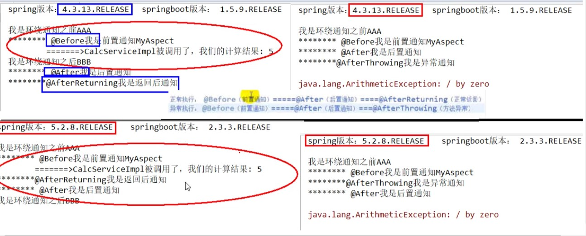

# Spring AOP

## 分类

spring有2种实现AOP的方式:

* 使用jdk提供的Proxy包, 对**接口类的方法**进行增强:

```java
interface UserMapper {
    void insert();
}
```

```java
class NaiveUserMapperImpl implements UserMapper {
    public void insert() {
        // 实现逻辑
    }
}

class ComplexUserMapperImpl implements UserMapper {
    public void insert() {
        UserMapper naiveUserMapper = new NaiveUserMapperImpl();

        // 在getProxyInstance工具类实现增强逻辑
        Proxy proxy = Proxy.getProxyInstance(naiveUserMapper);
    }
}
```

* 使用自带的cglib, 对**普通类的方法**进行增强

```java
class UserMapper {
    public void insert() {
        // ...
    }
}
```

```java
class NaiveUserMapperImpl extends UserMapper {
    public void insert() {
        super.insert();
        // 实现逻辑
    }
}

class ComplexUserMapperImpl extends UserMapper {
    public void insert() {
        // cglib
    }
}
```

## 术语

* 连接点, **可以**被增强的方法
* 切入点, **真正**被增强的方法
* 通知(增强), 具体的**增强逻辑**
  * 前置通知, 方法前的增强
  * 后置通知, 方法后的增强
  * 环绕通知, 方法前后的增强
  * 异常通知, 方法发生异常时的增强
  * 最终通知, 方法结束时的增强, **一定执行**
* 切面, 将通知应用到切入点

## AspectJ实现AOP

* 切入点表达式  
execution(  
    \[权限修饰符, "\*"表示任意权限]  
    \[返回类型, 可省略]  
    \[被增强类全路径]  
    \.[切入点方法, "\*"表示所有连接点]  
    \([参数列表, ".."表示所有参数])  
    )
* 基于xml配置
* 基于注解
  * 前置通知, @Before
  * 后置通知, @AfterReturning
  * 环绕通知, @Around
  * 异常通知, @AfterThrowing
  * 最终通知, @After
  * @Pointcut用于提取公共切入点表达式
  * @Order用于指定多个增强类的优先级， 越小优先级越高
* AOP执行顺序



## 声明式事务管理

* 基于XML配置
  * 配置方法等同于AOP增强
* 基于注解
  * @Transactional(args)
  * 事务注解里的枚举参数args包括:
    * propagation 多个业务方法间互相调用, 事务的传播机制
      * REQUIRED(**默认值**) 如有外层事务, 则当前业务可利用外层事务; 否则, 当前业务开启新事务
      * REQUIRED_NEW 当前业务必须开启新事务, 如果有外层事务, 则将其挂起
      * SUPORTS 如有外层事务, 则当前业务可利用外层事务; 否则, 当前业务不使用事务
      * NOT_SUPPORTED 当前业务必须不使用事务, 如果有外层事务, 则将其挂起
      * MANDATORY 当前业务必须使用事务, 无论利用外层或开启新事务, 否则抛出异常
      * NEVER  当前业务必须不使用事务, 否则抛出异常
      * NESTED 如有外层事务, 则当前业务必须使用其嵌套事务, 否则, 当前业务开启新事务
    * isolation 事务隔离级别
      * READ_UNCOMMITED 解决脏写
      * READ_COMMITED 解决脏读
      * REPEATABLE_READ 解决不可重复读
      * SERIALIZE 解决幻读
      * DEFAULT 使用当前数据库引擎的默认隔离级别
    * timeout 事务超时回滚界限, 秒, 默认-1
    * readOnly 是否只能select, 默认false
    * rollbackFor 哪些异常进行回滚
    * noRollBackFor 哪些异常不进行回滚
  * 完全注解式事务

## Spring5新特性

* 整合Log4j2
* @Nullable
  * 可以修饰方法, 属性, 参数
  * 表示被修饰目标可以为空, 而不报NullPointerException
* @NonNull
  * 可以修饰方法, 属性, 参数
  * 表示被修饰目标不能空, 否则IDE报错
* 函数式Bean创建GenericApplicationContext
* 整合JUnit5
  * 注入式测试
  